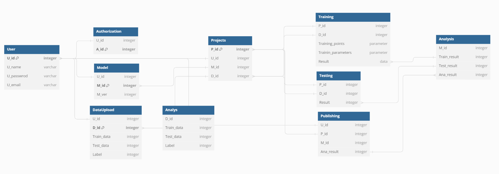

## Core Tables and Their Functions
### User
Purpose: Stores essential information about the system users.
Fields:
U_id: Unique identifier for the user (Primary Key).
U_name: The user's name.
U_password: User's password for access control.
U_email: User's email address for communication.
### Authorization
Purpose: Manages user permissions and access levels.
Fields:
U_id: Links to the User table, indicating the user these permissions apply to.
A_id: Unique identifier for the authorization entry (Primary Key).
### DataUpload
Purpose: Tracks data uploaded by users for projects.
Fields:
U_id: Identifies the user who uploaded the data.
D_id: Unique data upload identifier (Primary Key).
Train_data, Test_data: Identifiers for training and testing datasets.
Label: An integer representing the classification or categorization of the data.
### Analys
Purpose: Stores analysis details related to data uploads.
Fields:
D_id: Links to the DataUpload table.
Train_data, Test_data, Label: Replicate the fields from DataUpload for analysis purposes.
### Projects
Purpose: Manages projects, which involve users, models, and datasets.
Fields:
P_id: Unique project identifier (Primary Key).
U_id, M_id, D_id: Link to User, Model, and DataUpload tables respectively.
### Model
Purpose: Contains information about models developed by users.
Fields:
U_id: Identifies the user who developed the model.
M_id: Unique model identifier (Primary Key).
M_ver: Model version number.
### Training
Purpose: Records details of the training process for models within projects.
Fields:
P_id, D_id: Link to Projects and DataUpload tables.
Training_points, Training_parameters, Result: Details of the training process and outcomes.
### Testing
Purpose: Records the outcomes of testing models against datasets.
Fields:
P_id, D_id: Link to Projects and DataUpload tables.
Result: Numeric result of the testing process.
### Analysis
Purpose: Stores the results of analyzing model training and testing outcomes.
Fields:
M_id: Links to the Model table.
Train_result, Test_result, Ana_result: Numeric indicators of analysis outcomes.
### Publishing
Purpose: Manages the publication of projects, including models and their analyses.
Fields:
U_id, P_id, M_id: Link to User, Projects, and Model tables.
Ana_result: Links to the Analysis table for publishing analysis outcomes.

## Relationships
The database design establishes a network of relationships between tables to support complex data integrity constraints and facilitate operations across the system. For example:

Users are linked to their authorizations, data uploads, projects, models, and publishing activities, supporting a comprehensive user management and activity tracking system.
Projects serve as central hubs, connecting users, models, and datasets to training, testing, and publishing processes.
The training and testing tables are intricately linked to projects and datasets, ensuring that the outcomes of these activities are accurately recorded and associated with the correct project and data.
The Analysis table aggregates results from training and testing, providing a foundation for informed decision-making and publishing.
This structure supports a wide array of operations crucial to the system's functionality, such as project management, model development, data analysis, and dissemination of results. It ensures scalability and flexibility, accommodating future expansions and enhancements.

 

Fig 1 Structure of database.

